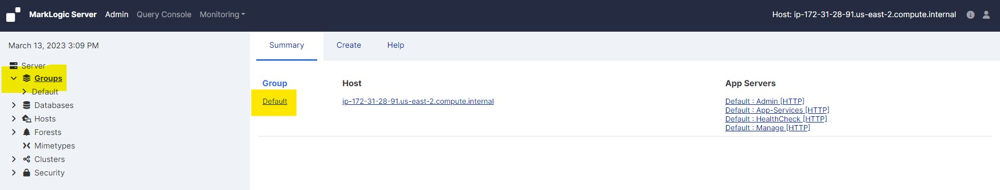
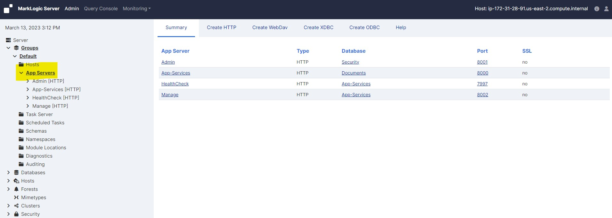
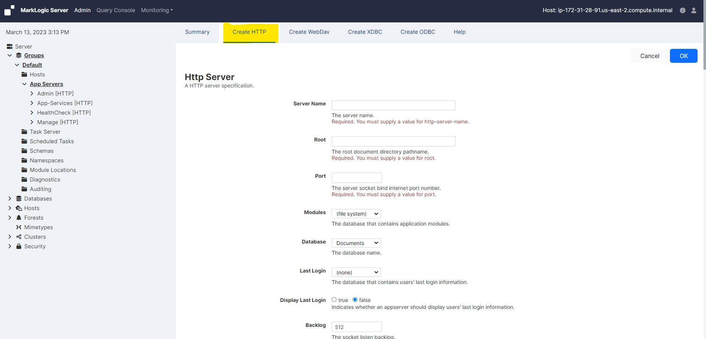
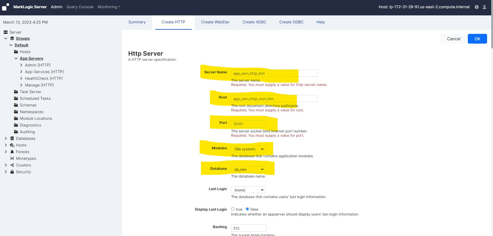
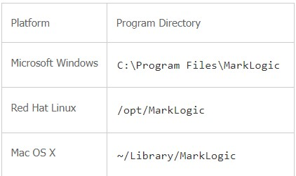
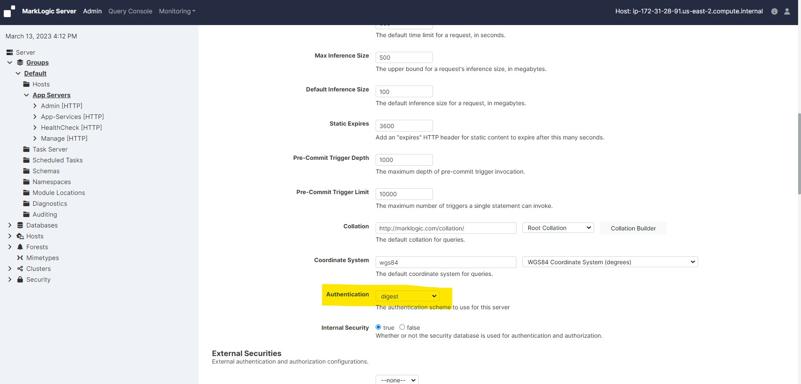
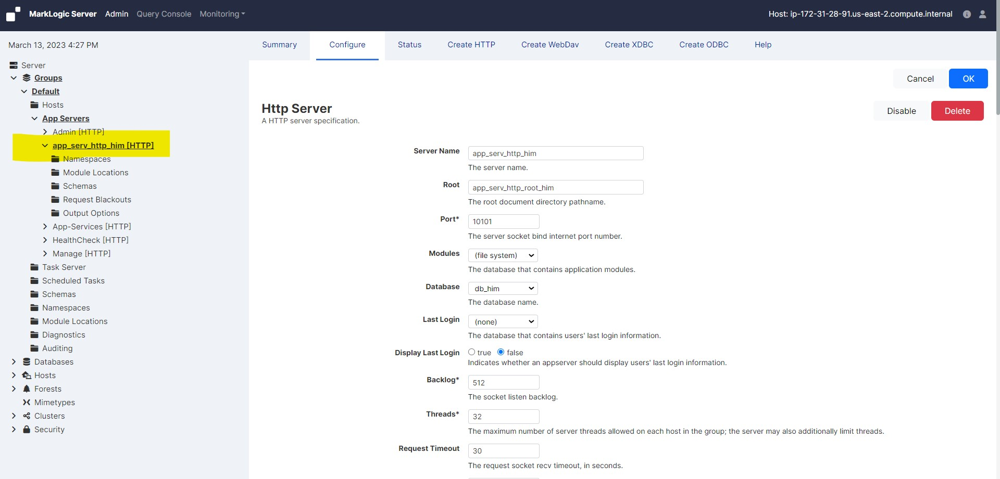

# Create a new HTTP server

### To create a new server, complete the following steps:

* Log into the Admin Interface in a browser. It is on port 8001 of the host in which MarkLogic is running. From your windows machine, http://18.222.133.222:8001 (In this case the EC2 instance IP is 18.222.133.222. Accordingly you neee to change it as per your EC2 instance IP).

* You will be prompted to log in with your admin username and password

     <!-- {"left" : 0.26, "top" : 1.45, "height" : 6.17, "width" : 9.74} -->

* Click the Groups icon in the left tree menu

* Click the group in which you want to define the HTTP server (for example, Default)

     <!-- {"left" : 0.26, "top" : 1.45, "height" : 6.17, "width" : 9.74} -->

* Click the App Servers icon on the left tree menu

     <!-- {"left" : 0.26, "top" : 1.45, "height" : 6.17, "width" : 9.74} -->

* Click the Create HTTP tab at the top right. The Create HTTP Server page will display

     <!-- {"left" : 0.26, "top" : 1.45, "height" : 6.17, "width" : 9.74} -->

* In the Server Name field, enter a shorthand name for this HTTP server. MarkLogic Server will use this name to refer to this server on display screens in the Admin Interface

     <!-- {"left" : 0.26, "top" : 1.45, "height" : 6.17, "width" : 9.74} -->

* In the Root directory field, enter the name of the directory in which you will store your programs

* If the Modules field is set to file system, then the root directory is either a fully-qualified pathname or is relative to the directory in which MarkLogic Server is installed

    - The following table shows the default installation directory for each platform:

         <!-- {"left" : 0.26, "top" : 1.45, "height" : 6.17, "width" : 9.74} -->

    - Do not create XDBC server root directories named Docs, Data or Admin. These directories are reserved by MarkLogic Server for other purposes

* In the Port field, enter the port number through which you want to make this HTTP server available

    - The port number must not be assigned to any other HTTP, ODBC, XDBC, or WebDAV server

* In the Modules field, select the database to use as the modules database for your documents, or leave it at the default of storing your modules on the file system

* In the Database field and select the database to be accessed by this HTTP server

* Scroll to the Authentication field. Select an authentication scheme. The default is digest, which uses encrypted passwords

     <!-- {"left" : 0.26, "top" : 1.45, "height" : 6.17, "width" : 9.74} -->

* Leave everything as default

* Scroll to the top or bottom and click OK

* You successfully created an HTTP app server

     <!-- {"left" : 0.26, "top" : 1.45, "height" : 6.17, "width" : 9.74} -->