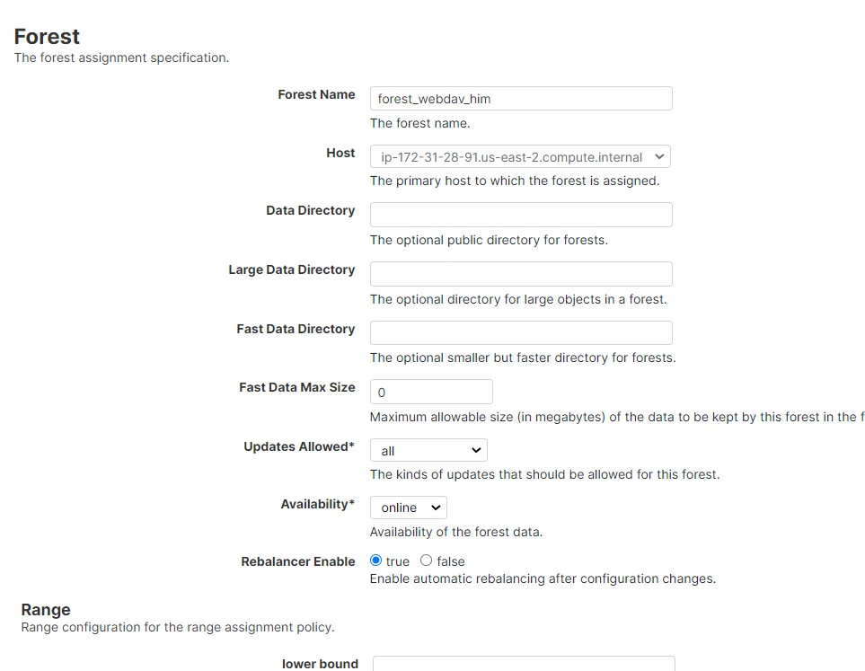
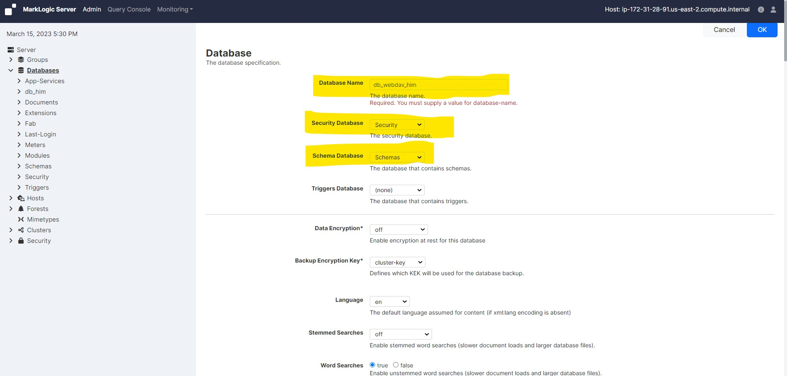
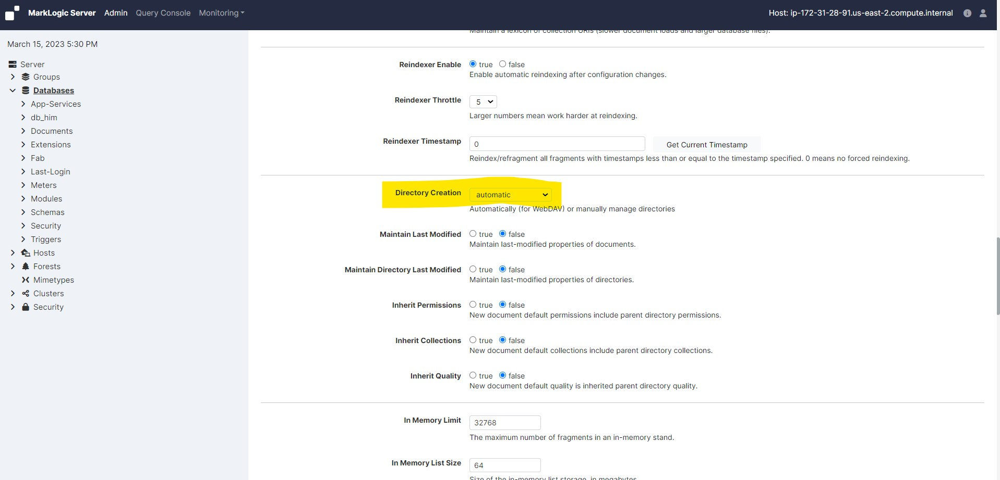
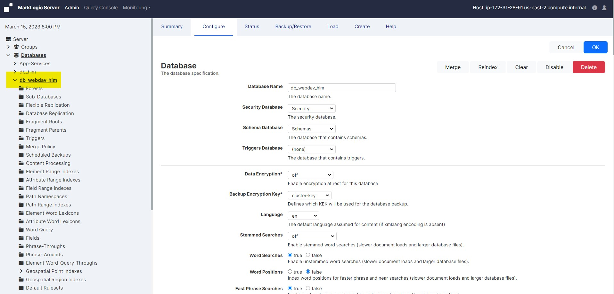
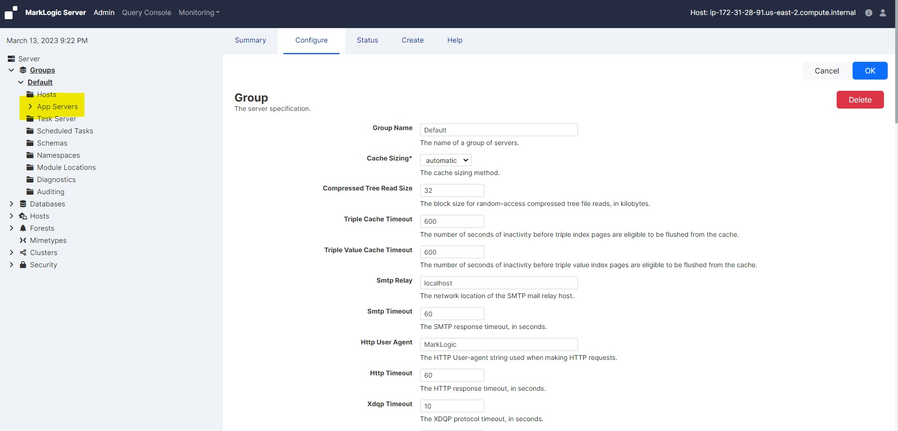
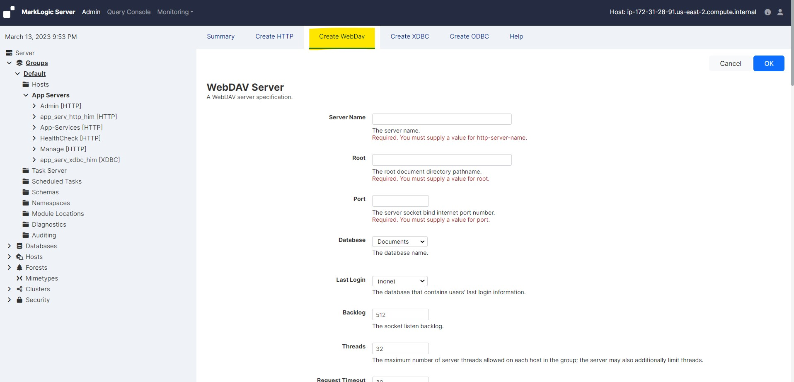
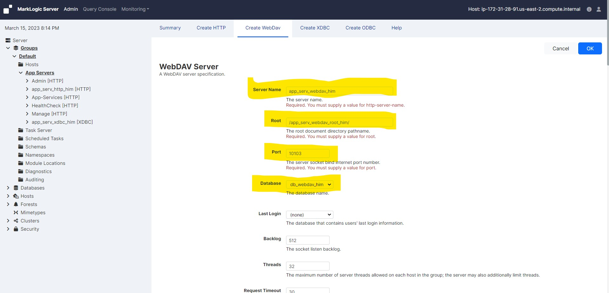
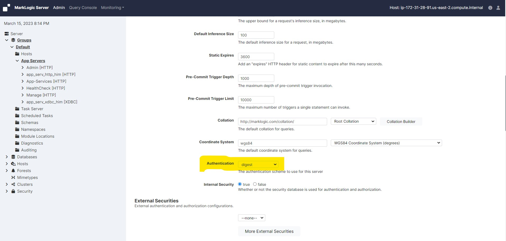
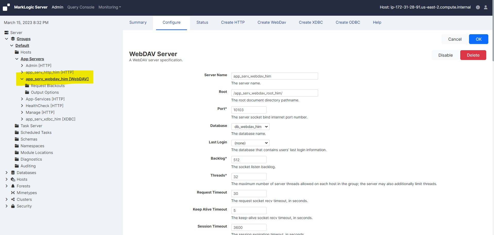

# Create a new WebDAV server

## To create a new server, complete the following steps:

### Step 1: Creat a forest

* Create a new forest

     <!-- {"left" : 0.26, "top" : 1.45, "height" : 6.17, "width" : 9.74} -->

### Step 2: Creat a database

* Create a new database

* Provide a database name, select "Security" as Security Database, select "Schemas" as Schema Database

     <!-- {"left" : 0.26, "top" : 1.45, "height" : 6.17, "width" : 9.74} -->

* Scrol down and select the Directory creation option to automatic

     <!-- {"left" : 0.26, "top" : 1.45, "height" : 6.17, "width" : 9.74} -->

* Click OK

     <!-- {"left" : 0.26, "top" : 1.45, "height" : 6.17, "width" : 9.74} -->

* Attach this database to the forest

### Step 3: Creat a WebDAV server

* Log into the Admin Interface in a browser. It is on port 8001 of the host in which MarkLogic is running. From your windows machine, http://18.222.133.222:8001 (In this case the EC2 instance IP is 18.222.133.222. Accordingly you neee to change it as per your EC2 instance IP).

* You will be prompted to log in with your admin username and password

     <!-- {"left" : 0.26, "top" : 1.45, "height" : 6.17, "width" : 9.74} -->

* Click the Groups icon in the left tree menu

* Click the group in which you want to define the XDBC server (for example, Default)

     <!-- {"left" : 0.26, "top" : 1.45, "height" : 6.17, "width" : 9.74} -->

* Click the App Servers icon on the left tree menu

     <!-- {"left" : 0.26, "top" : 1.45, "height" : 6.17, "width" : 9.74} -->

* Click the Create WebDAV tab at the top right. The Create WebDAV Server page displays.

     <!-- {"left" : 0.26, "top" : 1.45, "height" : 6.17, "width" : 9.74} -->

* In the WebDAV Server Name field, enter a shorthand name for this WebDAV server. MarkLogic Server will use this name to refer to this server on display screens and in user interface controls

     <!-- {"left" : 0.26, "top" : 1.45, "height" : 6.17, "width" : 9.74} -->

* Go to the root field and enter the name of WebDAV root. This root is a string that represents the top-level of the WebDAV URI hierarchy. Any document accessible through this WebDAV server must have a URI that begins with this root string

* In the Port field, enter the port number through which you want to make this WebDAV server available

    - The port number must not be assigned to any other servers.

* Go to the Database field and select the database to be accessed by this WebDAV server

    - If you are using a database with a WebDAV server, the directory creation setting on the database should be set to automatic, which will automatically create the root directory and other directories for any documents added to the database (if the directory does not already exist)

* Scroll to the Authentication field. Select an authentication scheme. The default is digest, which uses encrypted passwords

     <!-- {"left" : 0.26, "top" : 1.45, "height" : 6.17, "width" : 9.74} -->

* Leave everything as default

* Scroll to the top or bottom and click OK

* You successfully created a WebDAV server

     <!-- {"left" : 0.26, "top" : 1.45, "height" : 6.17, "width" : 9.74} -->