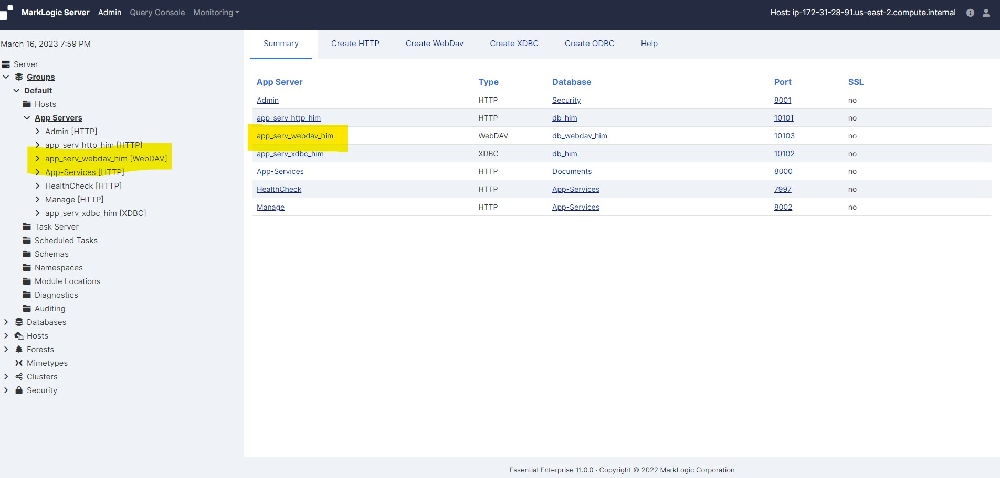
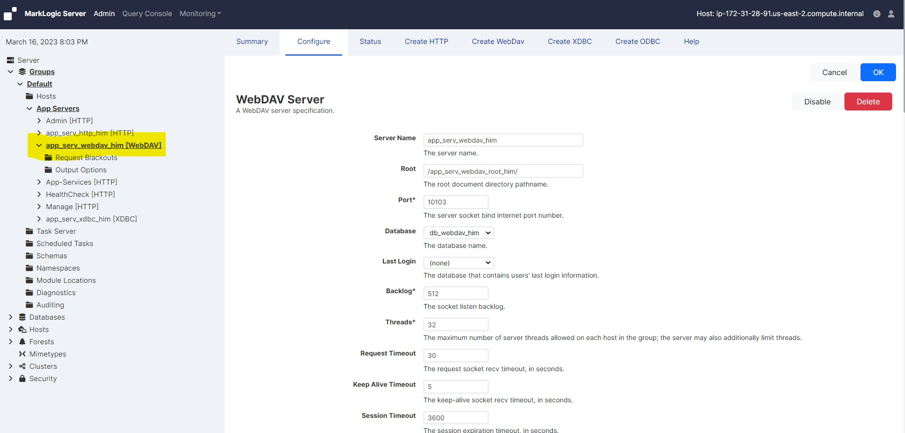
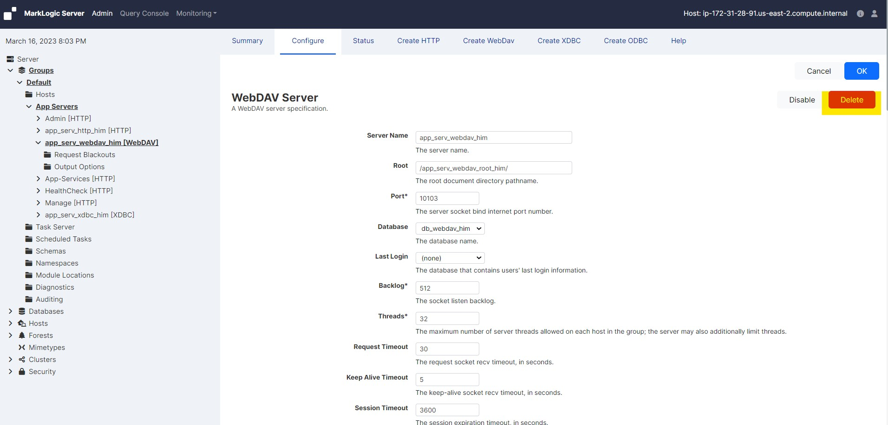
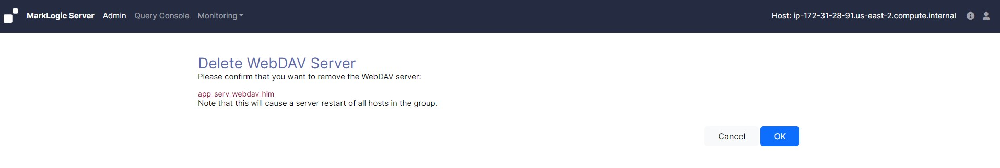

# Deleting a WebDAV server

### To delete the settings for a WebDAV server, complete the following steps:

* Log into the Admin Interface in a browser. It is on port 8001 of the host in which MarkLogic is running. From your windows machine, http://18.222.133.222:8001 (In this case the EC2 instance IP is 18.222.133.222. Accordingly you neee to change it as per your EC2 instance IP).

* You will be prompted to log in with your admin username and password

     <!-- {"left" : 0.26, "top" : 1.45, "height" : 6.17, "width" : 9.74} -->

* Click the Groups icon in the left tree menu

* Click the group which contains the WebDAV server you want to delete (for example, Default)

     <!-- {"left" : 0.26, "top" : 1.45, "height" : 6.17, "width" : 9.74} -->

* Click the App Servers icon on the left tree menu

     <!-- {"left" : 0.26, "top" : 1.45, "height" : 6.17, "width" : 9.74} -->

* Locate the WebDav server you want to delete, either in the tree menu or on the summary page

     <!-- {"left" : 0.26, "top" : 1.45, "height" : 6.17, "width" : 9.74} -->

* Click the icon for this WebDAV server

     <!-- {"left" : 0.26, "top" : 1.45, "height" : 6.17, "width" : 9.74} -->

* Click Delete

     <!-- {"left" : 0.26, "top" : 1.45, "height" : 6.17, "width" : 9.74} -->

* A confirmation message displays. Confirm the delete and click OK

     <!-- {"left" : 0.26, "top" : 1.45, "height" : 6.17, "width" : 9.74} -->

* Deleting a WebDAV server is a cold admin task; the server restarts to reflect your changes.