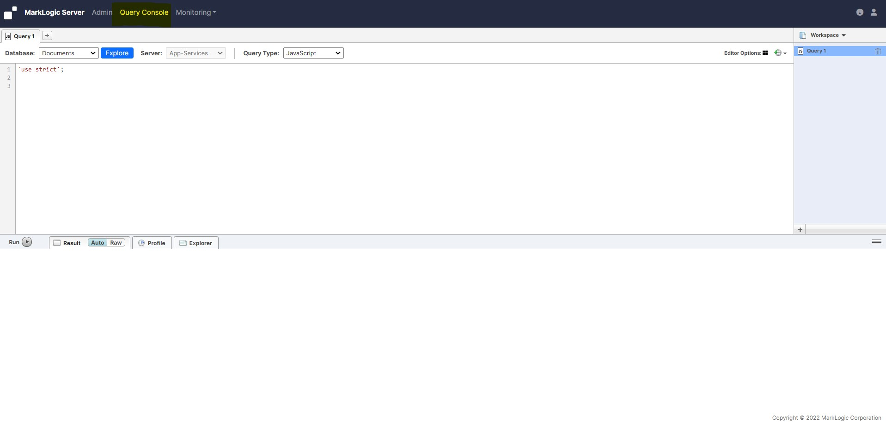
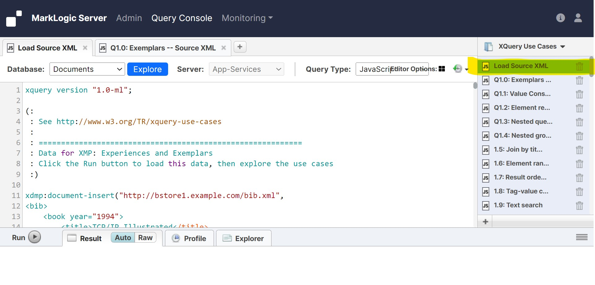

# Exploring the Use Cases

### To explore the use cases, complete the following steps:

* Copy the sample use case file from EC2 instance to your local machine (Windows)

    - Open powelshell and cd to directory location where your Marklogic.pem file is located
    - run below command to copy file
    ```shell
        scp -i .\MarkLogic.pem ec2-user@3.21.52.79:/opt/MarkLogic/Samples/w3c-use-cases.xml .
    ```
    - Successfully copied the "w3c-use-cases.xml" file from EC2 to local machine (windows)

* Go to the following URL (In this case the EC2 instance IP is 3.21.52.79. Accordingly you neee to change it as per your EC2 instance IP):

    ```shell
        http://3.21.52.79:8000
    ```
     <!-- {"left" : 0.26, "top" : 1.45, "height" : 6.17, "width" : 9.74} -->

* Click the Query Console button in the top navigation bar

     <!-- {"left" : 0.26, "top" : 1.45, "height" : 6.17, "width" : 9.74} -->

* In Query Console, click the Workspace link (towards the upper right corner of Query Console) and select Import...

     <!-- {"left" : 0.26, "top" : 1.45, "height" : 6.17, "width" : 9.74} -->

* Navigate to <marklogic-dir>/Samples/w3c-use-cases.xml

    - If MarkLogic is running on the same machine as your browser, you can navigate to this directory (for example, c:/Program Files/MarkLogic/Samples on Windows or /opt/MarkLogic/Samples on Linux), but if MarkLogic is installed on a remote server, then you must copy this file from the server to the machine in which your browser is running, and then navigate to the directory where you copied the file.

     <!-- {"left" : 0.26, "top" : 1.45, "height" : 6.17, "width" : 9.74} -->

* Click Import. The W3C XQuery use cases are imported into Query Console.

* Click Load Source XML query buffer in the workspace pane to display the query into Query Console

     <!-- {"left" : 0.26, "top" : 1.45, "height" : 6.17, "width" : 9.74} -->

* Select the Query Type as Xquery

     <!-- {"left" : 0.26, "top" : 1.45, "height" : 6.17, "width" : 9.74} -->

* Click the Run button.

     <!-- {"left" : 0.26, "top" : 1.45, "height" : 6.17, "width" : 9.74} -->

* A confirmation message displays indicating the documents have been loaded.

     <!-- {"left" : 0.26, "top" : 1.45, "height" : 6.17, "width" : 9.74} -->

* The use cases are divided into the following categories, with each category having several queries:
    ```
    1.0: Exemplars
    2.0: Tree
    3.0: Sequence
    4.0: Relational
    5.0: SGML
    6.0: String Search
    7.0: Namespace
    8.0: Recursive
    9.0: Strong
    ```

* At this point, you have different options to explore the use cases. We recommend you use the following procedures as examples to maximize your experience with the use cases:
    - Viewing the Source XML
    - Viewing a Use Case
    - Editing a Use Case

### Viewing the Source XML

* This procedure focuses on the first use case topic, 1.0: Exemplars. You can view the source XML for any of the use cases.

* To view the source XML, complete the following steps:

    - Click the 1.0 Source XML query buffer in the workspace pane to display the query into Query Console.
    - View the source code in the query editor tab.
    - Click Run.
    - View the source XML at the bottom in the XQuery Results pane.

### Viewing a Use Case

* This procedure focuses on the first use case in Exemplars. You can view any use case in other topics as well.

* To view the use case, complete the following steps:

    - Click the 1.1 Value constraints query buffer in the workspace pane to display the query into Query Console.
    - View the source code in the query editor tab.
        ```
        Lists books published by Addison-Wesley after 1991 including their year and title.
        ```
    - Notice that XQuery comments are wrapped in smiley faces: (: comment :)
    - Click Run.
    - View your results.
    - The following shows the results:
         <!-- {"left" : 0.26, "top" : 1.45, "height" : 6.17, "width" : 9.74} -->

### Editing a Use Case

* This procedure focuses on the first use case in Exemplars. You can edit any use case in the list.

* To edit a use case, complete the following steps:

    - Click the 1.1 Value constraints query buffer in the workspace pane to display the query into Query Console.
    - View the source code in the query editor tab.
    - Change the following source from:
        ```
        where $b/publisher = "Addison-Wesley" and $b/@year > 1991
        ```
        to:
        ```
        where $b/publisher = "Addison-Wesley" and $b/@year > 1993 
        ```
    - Click Run.
    - View the new query results.
          <!-- {"left" : 0.26, "top" : 1.45, "height" : 6.17, "width" : 9.74} -->   

* You may change the source as much as you like. Explore and customize each use case as thoroughly as possible. You can reload the workspace from the Sample directory to restore it.
