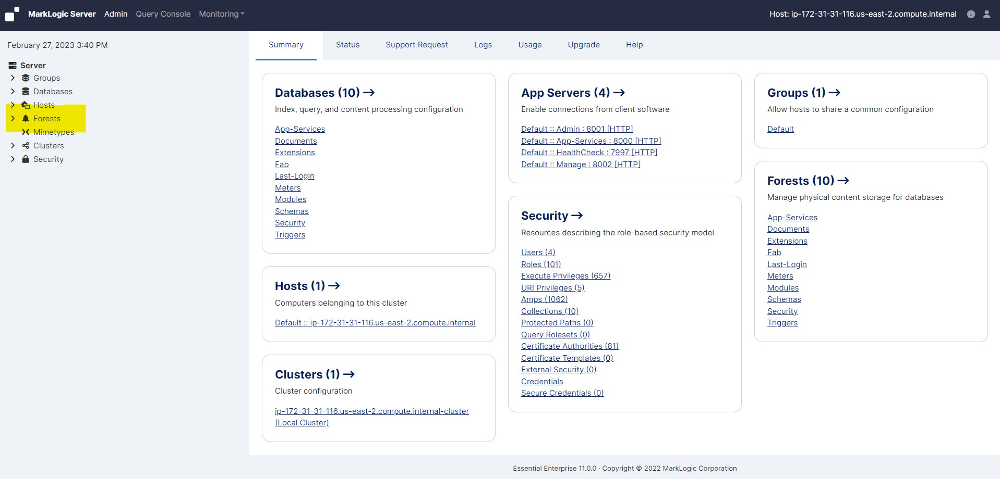
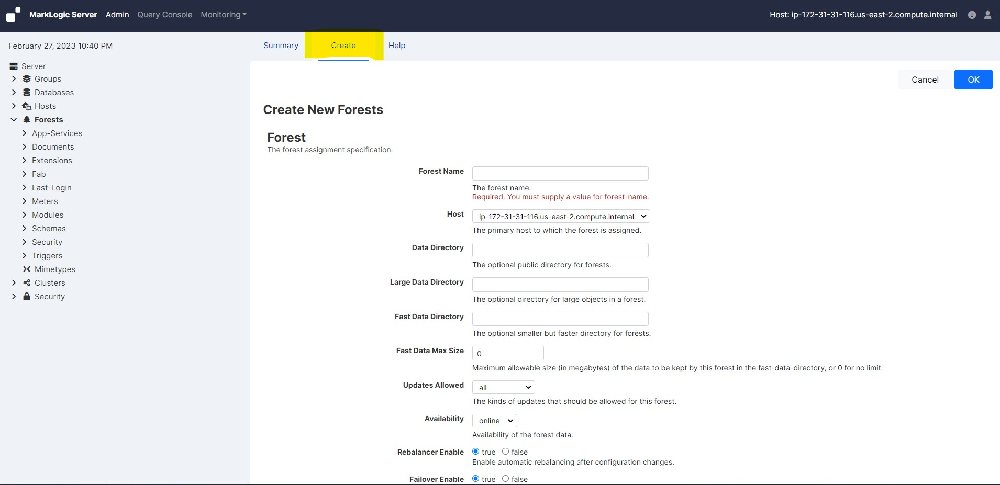
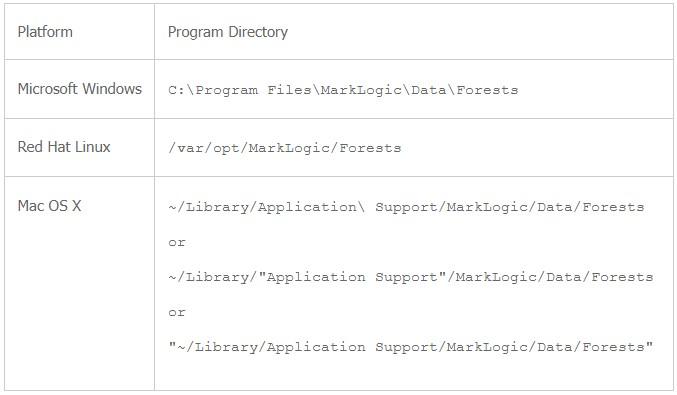
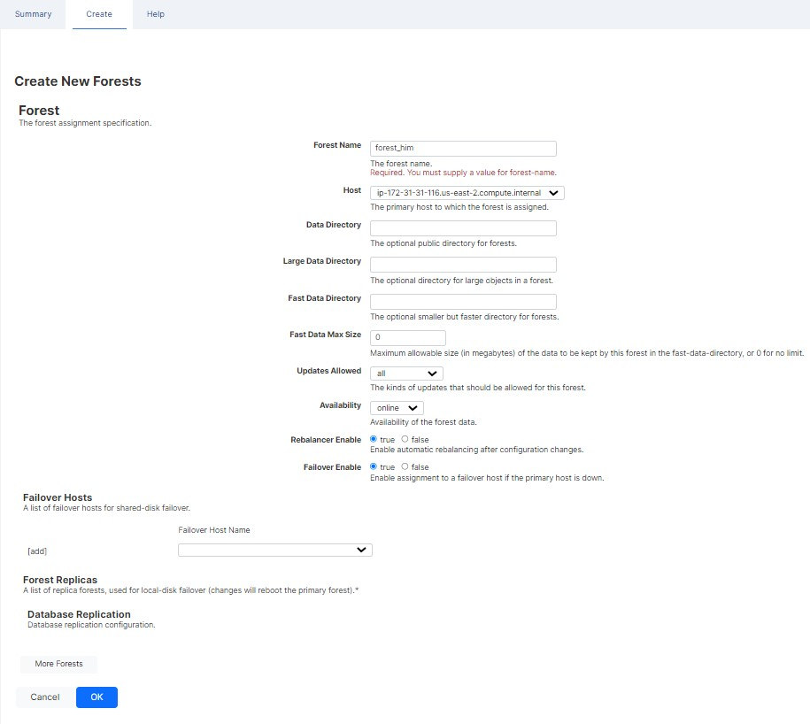
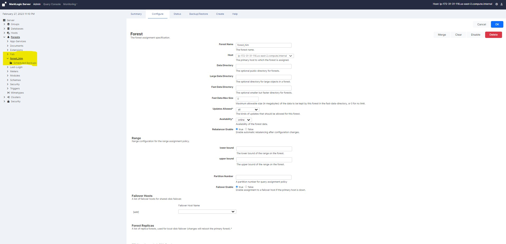

# Create a Forest

In this lab we will practice the Forest creation. 

### To create a new forest, complete the following procedure:

* Click the Forests icon in the left tree menu

     <!-- {"left" : 0.26, "top" : 1.45, "height" : 6.17, "width" : 9.74} -->

* Click the Create tab at the top right. The Create Forest page displays:

     <!-- {"left" : 0.26, "top" : 1.45, "height" : 6.17, "width" : 9.74} -->

* Enter the name of your forest in the Forest Name textbox. Each forest name must be unique.

* Select the host on which you want the forest to be created.

* Enter the path to the Data Directory, which specifies where the forest data is stored. This directory should specify a location on the host's file system with sufficient capacity to store your data

* It can be file system path, it can be an HDFS path, or it can be an S3 path

* The following table shows the default location Forest directory for each platform:

     <!-- {"left" : 0.26, "top" : 1.45, "height" : 6.17, "width" : 9.74} -->

* If you want to specify a different directory to store large objects (such as large binary documents), specify a Large Data Directory. If you do not specify a large data directory, the Data Directory is used

* In the Availability field, select online to make the forest data available to tiered-storage or offline to make the data unavailable

* In the Rebalancer Enable field, specify whether or not you want this forest to participate in the rebalancer process for the database to which this forest is to be attached

* If you have enabled the database rebalancer with a document assignment policy of Range, specify the range for this forest in the Range field

* In the Failover Enable field, specify whether or not to failover this forest to another host if the primary host goes down

* Select the Failover Host from the Failover Host Name drop down menu

* Click OK

     <!-- {"left" : 0.26, "top" : 1.45, "height" : 6.17, "width" : 9.74} -->

* Forest successfully created

     <!-- {"left" : 0.26, "top" : 1.45, "height" : 6.17, "width" : 9.74} -->