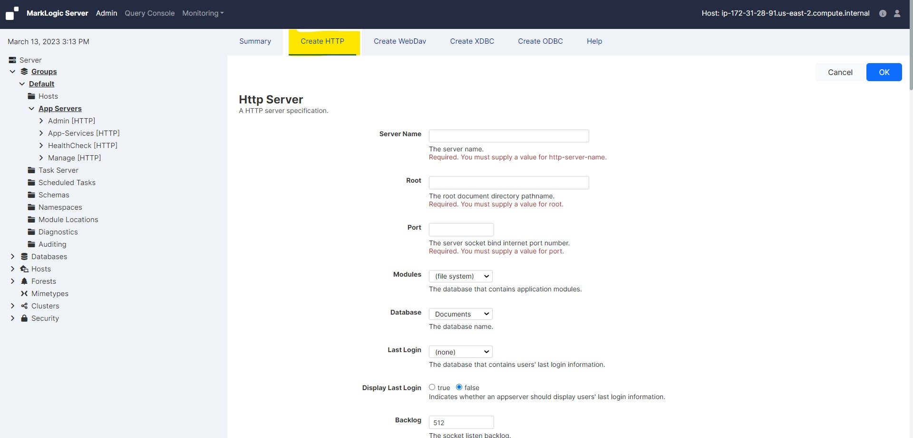

# Create a HTTP app server for XQuery application use case

### To create a new App Server, complete the following steps:

* Open a new browser window or tab.

* Log into the Admin Interface in a browser. It is on port 8001 of the host in which MarkLogic is running. From your windows machine, http://3.21.52.79:8001 (In this case the EC2 instance IP is 3.21.52.79. Accordingly you neee to change it as per your EC2 instance IP).

* You will be prompted to log in with your admin username and password

     <!-- {"left" : 0.26, "top" : 1.45, "height" : 6.17, "width" : 9.74} -->

* Click the Groups icon in the left tree menu

* Click the group in which you want to define the HTTP server (for example, Default)

     <!-- {"left" : 0.26, "top" : 1.45, "height" : 6.17, "width" : 9.74} -->

* Click the App Servers icon on the left tree menu

     <!-- {"left" : 0.26, "top" : 1.45, "height" : 6.17, "width" : 9.74} -->

* Click the Create HTTP tab at the top right. The Create HTTP Server page will display

     <!-- {"left" : 0.26, "top" : 1.45, "height" : 6.17, "width" : 9.74} -->

* Go to the HTTP Server Name field and enter "TestServer".
    - This is the name that the Admin Interface uses to reference your server on display screens and in user interface controls.

     <!-- {"left" : 0.26, "top" : 1.45, "height" : 6.17, "width" : 9.74} -->

* Go to the Root directory field and enter "/space/test" (or whatever directory you want for your App Server root, for example c:/space/test on a Windows system).
    - By default, the software looks for this directory in your MarkLogic Server program directory. But it is much better practice to specify an absolute path (such as C:\space\test on a Windows platform or /space/test on a Linux platform)

* Go to the Port field and enter "8005" (or whatever port you want to use for this App Server).

* The following screen shows an HTTP server with these values:

     <!-- {"left" : 0.26, "top" : 1.45, "height" : 6.17, "width" : 9.74} -->

* Scroll down to Authentication and select application-level.

    - This makes it so you do not need to enter a username or password against this App Server. If you want to enter a username and password, leave this setting as digest.

* Choose an admin user (it has the word admin in parenthesis) as the Default User.

* Leave the privilege field blank.

* The following screen shows an HTTP server with these values:

     <!-- {"left" : 0.26, "top" : 1.45, "height" : 6.17, "width" : 9.74} -->

* Leave everything as default

* Scroll to the top or bottom and click OK

* See that TestServer is added to the HTTP Server branch.

     <!-- {"left" : 0.26, "top" : 1.45, "height" : 6.17, "width" : 9.74} -->