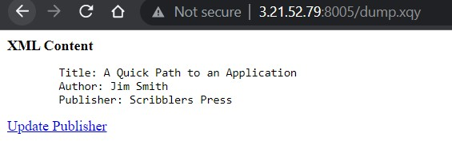

# Create a sample XQuery application

## To create and run the sample XQuery application, complete the following steps:

* This procedure assumes you are using the application directory "/space/test". If you are using a different directory (for example, c:/space/test), just make everything relative to that directory.

* Create a directory on the host in which MarkLogic is running named "/space/test" (or whatever directory you want).
    - Connect to EC2 machine from Windows using ssh
    - Open powershell terminal
    - cd to working directory
    - connect to EC2. In this case EC2 instance is ec2-user@3.21.52.79. Check your EC2 instancse and change below command accourdingly
        ```
        ssh -i ./MarkLogic.pem ec2-user@3.21.52.79
        ```
    - Create directory "/space/test"
        ```
        sudo mkdir -p /space/test
        ```
    - Change directory permisson
        ```
        sudo chmod 777 /space
        sudo chmod 777 /space/test
        ```

* Open a text editor and create a new file called "load.xqy" in the /space/test directory
    ```
    vi load.xqy
    ```
* Copy and save the following code into this .xqy file:
    ```
    xquery version "1.0-ml";
    (: load.xqy :)
    xdmp:document-insert("books.xml",
    <books xmlns="http://www.marklogic.com/ns/gs-books">
        <book bookid="1">
        <title>A Quick Path to an Application</title>
        <author>
            <last>Smith</last>
            <first>Jim</first>
        </author>
        <publisher>Scribblers Press</publisher>
        <isbn>1494-3930392-3</isbn>
        <abstract>This book describes in detail the power of how to use XQuery to build powerful web applications that are built on the MarkLogic Server platform.</abstract>
        </book>
    </books>
    ),

    <html xmlns="http://www.w3.org/1999/xhtml">
    <head>
        <title>Database loaded</title>
    </head>

    <body>
    <b>Source XML Loaded</b>
    <p>The source XML has been successfully loaded into the database</p>
    </body>
    </html>
    ```
* save and close the editor with ":wq" command

* Create another file called "dump.xqy" in the /space/test directory.
    ```
    vi dump.xqy
    ```

* Copy and save the following code into this .xqy file:

    ```
    xquery version "1.0-ml";
    (: dump.xqy :)
    declare namespace bk = "http://www.marklogic.com/ns/gs-books";

    <html xmlns="http://www.w3.org/1999/xhtml">
    <head>
        <title>Database dump</title>
    </head>
    <body>
    <b>XML Content</b>
    {
        for $book in doc("books.xml")/bk:books/bk:book
        return
        <pre>
            Title: { $book/bk:title/text() }
            Author: { ($book/bk:author/bk:first/text(), " ",
            $book/bk:author/bk:last/text()) }
            Publisher: { $book/bk:publisher/text() }
        </pre>
    }
        <a href="update-form.xqy">Update Publisher</a>
    </body>
    </html>
    ```
* save and close the editor with ":wq" command

* Create another file called "update-form.xqy" in the /space/test directory.

    ```
    vi update-form.xqy
    ```

* Copy and save the following code into this .xqy file:
    ```
    xquery version "1.0-ml";
    (: update-form.xqy :)
    declare namespace bk="http://www.marklogic.com/ns/gs-books";
    <html xmlns="http://www.w3.org/1999/xhtml">
    <head>
        <title>Change Publisher</title>
    </head>
    <body>
        {
        let $book := doc("books.xml")/bk:books/bk:book[1]
        return
        <form action="update-write.xqy">
            <input type="hidden" name="bookid" value="{ $book/@bookid }"/>
            <p><b>
    Change publisher for book <i>{ $book/bk:title/text() }</i>:
            </b></p>
            <input type="text" name="publisher"
                value="{ $book/bk:publisher/text() }"/>
            <input type="submit" value="Update publisher"/>
        </form>
    }
    </body>
    </html>
    ```

* save and close the editor with ":wq" command

* Create another file called "update-write.xqy" in the /space/test directory.

    ```
    vi update-write.xqy
    ```

* Copy and save the following code into this .xqy file:

    ```
    xquery version "1.0-ml";
    (: update-write.xqy :)
    declare namespace bk="http://www.marklogic.com/ns/gs-books";

    declare function local:updatePublisher()
    {
    if (doc("books.xml")) then
        let $bookid := xdmp:get-request-field("bookid")
        let $publisher := xdmp:get-request-field("publisher")
        let $b := doc("books.xml")/bk:books/bk:book[@bookid = $bookid]
    return
        if ($b) then
        (
        xdmp:node-replace($b/bk:publisher,
                <bk:publisher>{ $publisher }</bk:publisher>)
    ,
        xdmp:redirect-response("dump.xqy")
        )
        else
        <span>Could not locate book with bookid { $bookid }.</span>
        else
        <span>Unable to access parent XML document.</span>
    };

    <html xmlns="http://www.w3.org/1999/xhtml">
    <head>
        <title>Update In Process</title>
    </head>

    <body>
    Attempting to complete update and redirect browser to detail page.
        <p>
    If you are seeing this page, either the redirect has failed
    or the update has failed.  The update has failed if there is
    a reason provided below:
        <br/>
        { local:updatePublisher() }
        </p>
    </body>
    </html>
    ```

* save and close the editor with ":wq" command

* Confirm that you have the following new files in your test directory:
    - load.xqy
    - dump.xqy
    - update-form.xqy
    - update-write.xqy

* Confirm that all files end with the .xqy extension, not the .txt extension.

* Using these files, continue to the following procedures:
    - Loading the Source XML
    - Generating a Simple Report
    - Submitting New Information

### Loading the Source XML

* To load the source XML, complete the following procedure:

    - Go to the following URL (substitute your hostname):
        ```
        http://3.21.52.79:8005/load.xqy
        ```
    - MarkLogic Server runs the new load.xqy file.
    - View the following confirmation message:

         <!-- {"left" : 0.26, "top" : 1.45, "height" : 6.17, "width" : 9.74} -->

### Generating a Simple Report

* To generate a simple report from the newly loaded XML, complete the following steps:

    - Go to the following URL (substitute your hostname):
        ```
        http://3.21.52.79:8005/dump.xqy
        ```
    - MarkLogic Server runs the new dump.xqy file.
    - View the new HTML-compatible report:

         <!-- {"left" : 0.26, "top" : 1.45, "height" : 6.17, "width" : 9.74} -->

### Submitting New Information

* To submit new information to the database, complete the following steps:

    - Go to the following URL (substitute your hostname):
        ```
        http://3.21.52.79:8005/update-form.xqy
        ```
    - MarkLogic Server runs the new update-form.xqy file.
    - View the simple form to update a publisher:

         <!-- {"left" : 0.26, "top" : 1.45, "height" : 6.17, "width" : 9.74} -->
    - Enter "Menlo Books" as the new publisher.
    - Click Update publisher.
    - This action automatically calls update-write.xqy, which updates the publisher element in the database, and then redirects the browser to dump.xqy which displays the updated book information.

         <!-- {"left" : 0.26, "top" : 1.45, "height" : 6.17, "width" : 9.74} -->
    - (Optional) Continue exploring your new files or write your own code to create new XQuery applications.
