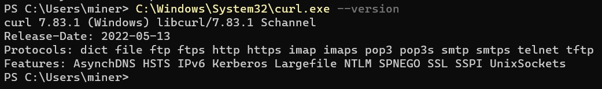
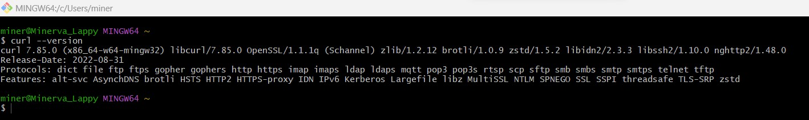

# Download Curl on Windows

## On latest Windows OS you can find curl as below:

* Open power shell

* You can use curl using this command:

    ```
     C:\Windows\System32\curl.exe --version
    ```

* You will see below output

     <!-- {"left" : 0.26, "top" : 1.45, "height" : 6.17, "width" : 9.74} -->

* If you are seeing the above output that means you can use curl commands on your windows machine

## Another way to use curl command is to install git bash on windows

* Download git bash from this [link](https://git-scm.com/downloads)

* Click on "Downlaod for Windows" button

     <!-- {"left" : 0.26, "top" : 1.45, "height" : 6.17, "width" : 9.74} -->

* Once downloaded double click the downloaded file to start installation.

* Once installed you can open git bash and run below command to check the curl version

    ```
     curl --version
    ```

* You will see below output

     <!-- {"left" : 0.26, "top" : 1.45, "height" : 6.17, "width" : 9.74} -->

* If you are seeing the above output that means you can use curl commands on your windows machine