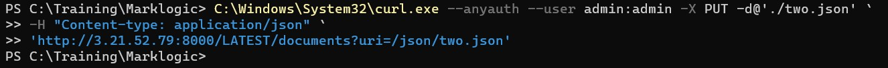

# Load Documents Into the Database

## To load the sample documents into the database:

* Navigate to the directory containing the sample documents you created in Preparation. Open powershell and cd to directory location where "one.xnl" and "two.json" is saved.

     <!-- {"left" : 0.26, "top" : 1.45, "height" : 6.17, "width" : 9.74} -->

* Execute the following command on your powershell to load one.xml into the database with the URI /xml/one.xml:

    ```
    C:\Windows\System32\curl.exe --anyauth --user admin:admin -X PUT -d@'./one.xml' `
    -H "Content-type: application/xml" `
    'http://<your-ec2-ip-address>:8000/LATEST/documents?uri=/xml/one.xml'
    ```

* You will get output like this

     <!-- {"left" : 0.26, "top" : 1.45, "height" : 6.17, "width" : 9.74} -->

* The URL tells the /documents service to create an XML document with database URI /xml/one.xml (uri=...) from the contents in the request body

* Execute the following command on your powershell to load two.json into the database with the URI /json/two.json:

    ```
    C:\Windows\System32\curl.exe --anyauth --user admin:admin -X PUT -d@'./two.json' `
	-H "Content-type: application/json" `
	'http://<your-ec2-ip-address>:8000/LATEST/documents?uri=/json/two.json'
    ```

* You will get output like this

     <!-- {"left" : 0.26, "top" : 1.45, "height" : 6.17, "width" : 9.74} -->

* Optionally, use Query Console to explore the database

* The database should contain 2 documents, /xml/one.xml and /json/two.json.