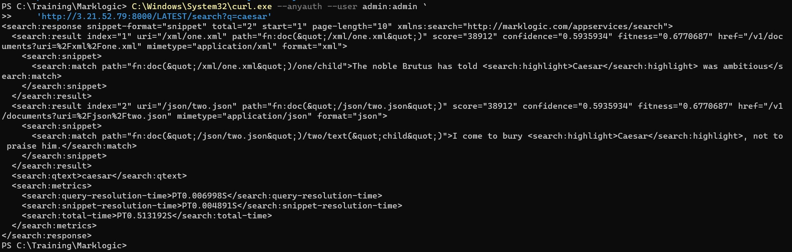
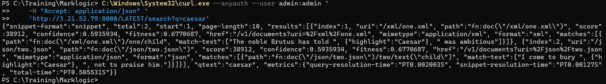

# Search Database

## To search the database:

* Open power shell

* Execute the following command to send a search request to the instance, requesting matches to the search string caesar. Results are returned as XML by default.

    ```
     C:\Windows\System32\curl.exe --anyauth --user admin:admin `
    'http://<your-ec2-ip-address>:8000/LATEST/search?q=caesar'
    ```

* You will see below output

     <!-- {"left" : 0.26, "top" : 1.45, "height" : 6.17, "width" : 9.74} -->

* Examine the XML search results returned in the response body. Notice that there are two matches, one in each document.

    ```
    <search:response snippet-format="snippet" total="2" start="1" ...>
  <search:result index="1" uri="/xml/one.xml" ...>
    <search:snippet>
      <search:match path="fn:doc(&quot;/xml/one.xml&quot;)/one/child">The noble Brutus has told <search:highlight>Caesar</search:highlight> was ambitious</search:match>
    </search:snippet>
  </search:result>
  <search:result index="2" uri="/json/two.json" path="fn:doc(&quot;/json/two.json&quot;)" score="2048" confidence="0.283107" fitness="0.235702">
    <search:snippet>
      <search:match path="fn:doc(&quot;/json/two.json&quot;)/*:json/*:two/*:child">I come to bury <search:highlight>Caesar</search:highlight>, not to praise him.</search:match>
    </search:snippet>
  </search:result>
  <search:qtext>caesar</search:qtext>
  <search:metrics>...</search:metrics>
</search:response>
    ```

* Run the search command again, generating JSON output by an Accept header:

    ```
    C:\Windows\System32\curl.exe --anyauth --user admin:admin `
    -H "Accept: application/json" `
    'http://<your-ec2-ip-address>:8000/LATEST/search?q=caesar'
    ```

* You will see below output

     <!-- {"left" : 0.26, "top" : 1.45, "height" : 6.17, "width" : 9.74} -->

* Examine the json earch result

    ```
    {
    "snippet-format": "snippet",
    "total": 2,
    "start": 1,
    "page-length": 10,
    "results": [
        {
        "index": 1,
        "uri": "\/xml\/one.xml",
        "path": "fn:doc(\"\/xml\/one.xml\")",
        "score": 2048,
        "confidence": 0.283107,
        "fitness": 0.235702,
        "matches": [
            {
            "path": "fn:doc(\"\/xml\/one.xml\")\/one\/child",
            "match-text": [
                "The noble Brutus has told ",
                {
                "highlight": "Caesar"
                },
                " was ambitious"
            ]
            }
        ]
        },
        {
        "index": 2,
        "uri": "\/json\/two.json",
        "path": "fn:doc(\"\/json\/two.json\")",
        "score": 2048,
        "confidence": 0.283107,
        "fitness": 0.235702,
        "matches": [
            {
            "path": "fn:doc(\"\/json\/two.json\")\/*:json\/*:two\/*:child",
            "match-text": [
                "I come to bury ",
                {
                "highlight": "Caesar"
                },
                ", not to praise him."
            ]
            }
        ]
        }
    ],
    "qtext": "caesar",
    "metrics": { ... }
    }
    ```

* Additional query features allow you to search using structured queries or Query By Example (QBE), to search by JSON property and value or XML element and element attribute values, and to search and analyze lexicons and range indexes

* You can also define search options to tailor your search and results
