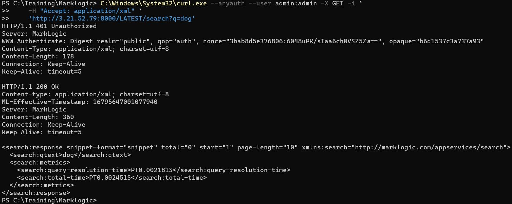
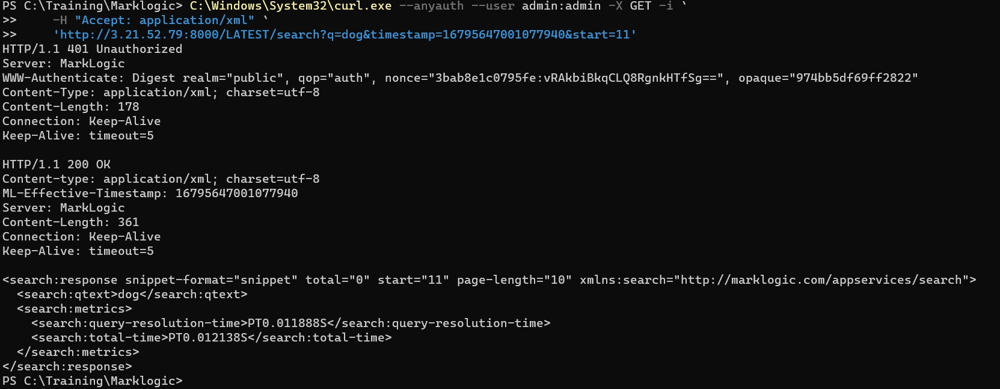

# Point in time operation

## Follow below steps:

* Open power shell

* Execute the following command:

    ```
     C:\Windows\System32\curl.exe --anyauth --user admin:admin `
    'http://<your-ec2-ip-address>:8000/LATEST/search?q=caesar'
    ```

* You will see below output

     <!-- {"left" : 0.26, "top" : 1.45, "height" : 6.17, "width" : 9.74} -->

* Execute the following command:

    ```
     C:\Windows\System32\curl.exe --anyauth --user admin:admin -X GET -i `
    -H "Accept: application/xml" `
    'http://3.21.52.79:8000/LATEST/search?q=dog&timestamp=16795647001077940&start=11'
    ```

* You will see below output

     <!-- {"left" : 0.26, "top" : 1.45, "height" : 6.17, "width" : 9.74} -->