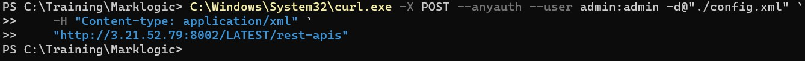
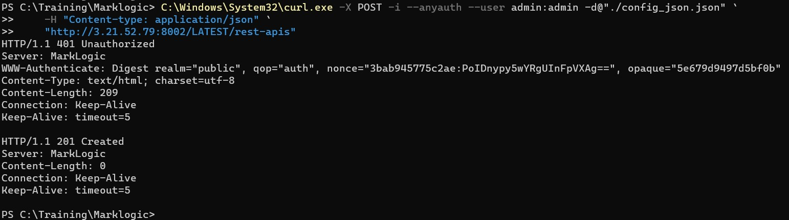

# Create an instance for REST api

## Create instance using XML config

* The following example creates an instance using the preceding XML configuration information, saved to a file named config.xml.

* Create a file "config.xml" in your windows machine and copy below content in that file

    ```
    <rest-api xmlns="http://marklogic.com/rest-api">
        <name>RESTstop</name>
        <database>Documents</database>
        <port>8020</port>
    </rest-api>
    ```
* Open power shell and cd to the directory where your config.xml is located

* Run bemow command:

    ```
    C:\Windows\System32\curl.exe -X POST --anyauth --user admin:admin -d@"./config.xml" `
    -H "Content-type: application/xml" `
    "http://3.21.52.79:8002/LATEST/rest-apis"
    ```

* You will see below output

     <!-- {"left" : 0.26, "top" : 1.45, "height" : 6.17, "width" : 9.74} -->

* You successfully created on REST instace with name "RESTstop" and port "8020"

## Create instance using XML config

* The following example creates an instance using the preceding JSON configuration information, saved to a file named config_json.json.

* Create a file "config_json.json" in your windows machine and copy below content in that file

    ```
    { "rest-api": {
        "name": "RESTstop_json",
        "database": "Documents",
        "port": "8030"
    } }
    ```
* Open power shell and cd to the directory where your config_json.json is located

* Run bemow command:

    ```
    C:\Windows\System32\curl.exe -X POST --anyauth --user admin:admin -d@"./config_json.json" `
    -H "Content-type: application/xml" `
    "http://3.21.52.79:8002/LATEST/rest-apis"
    ```

* You will see below output

     <!-- {"left" : 0.26, "top" : 1.45, "height" : 6.17, "width" : 9.74} -->

* You successfully created on REST instace with name "RESTstop_json" and port "8030"