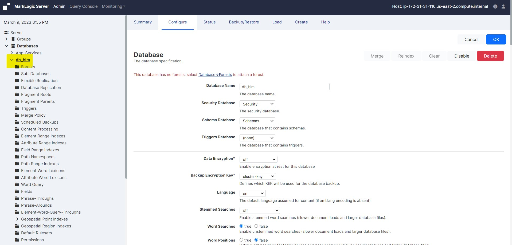
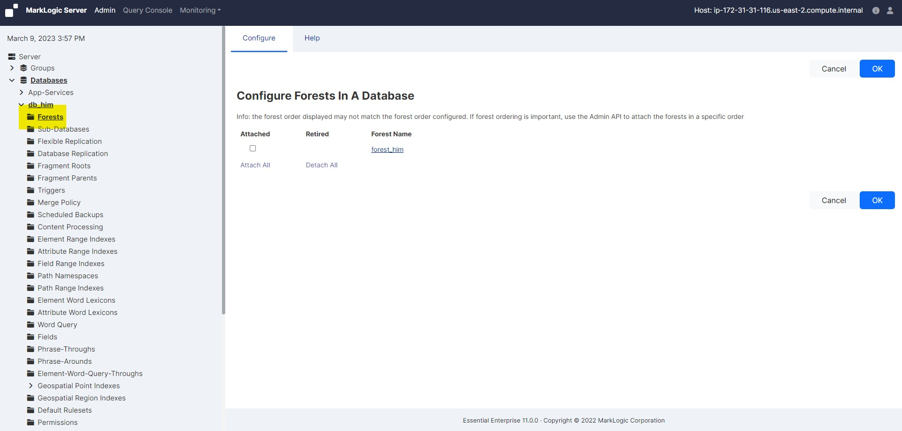
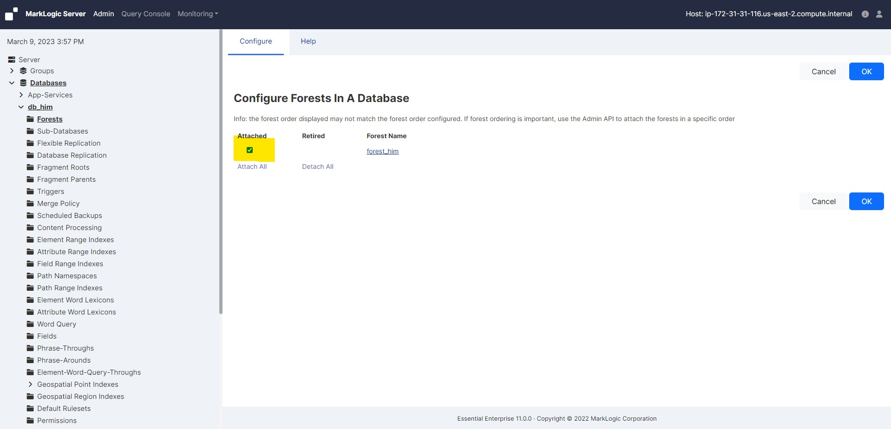

# Attach Forest to Databsase

In this lab we will practice how to attach forest to database. 

### Follow the following steps to attach a forest to database:

* Log into the Admin Interface in a browser. It is on port 8001 of the host in which MarkLogic is running. From your windows machine, http://18.222.133.222:8001 (In this case the EC2 instance IP is 18.222.133.222. Accordingly you neee to change it as per your EC2 instance IP).

* You will be prompted to log in with your admin username and password

     <!-- {"left" : 0.26, "top" : 1.45, "height" : 6.17, "width" : 9.74} -->

* Click the database to which you want to attach forests

     <!-- {"left" : 0.26, "top" : 1.45, "height" : 6.17, "width" : 9.74} -->

* Click the Forests icon for the database. The Database Forest Configuration Page appears:

     <!-- {"left" : 0.26, "top" : 1.45, "height" : 6.17, "width" : 9.74} -->

* Check the box corresponding to forest(s) you want to attach to the database. You can also uncheck forests you want to detach from the database.

     <!-- {"left" : 0.26, "top" : 1.45, "height" : 6.17, "width" : 9.74} -->

* Click OK

* The forests you attached or detached are now reflected in the database configuration. Attaching and detaching a forest to a database are hot admin tasks.