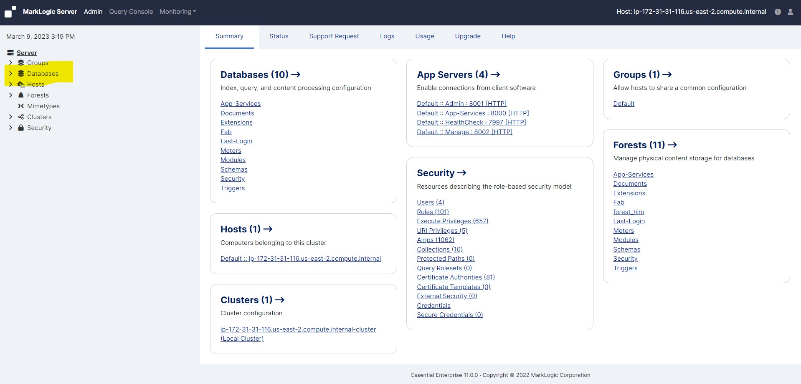
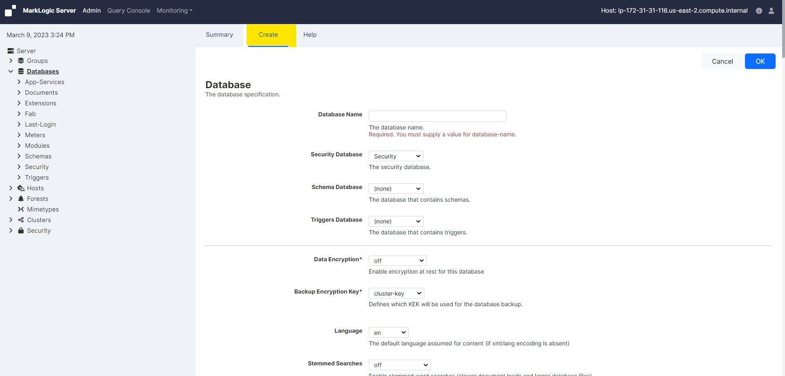
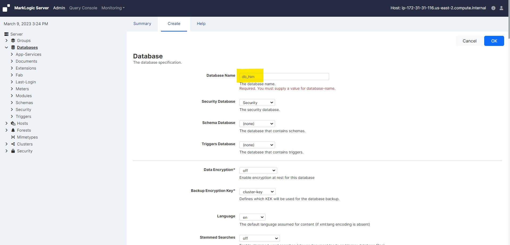
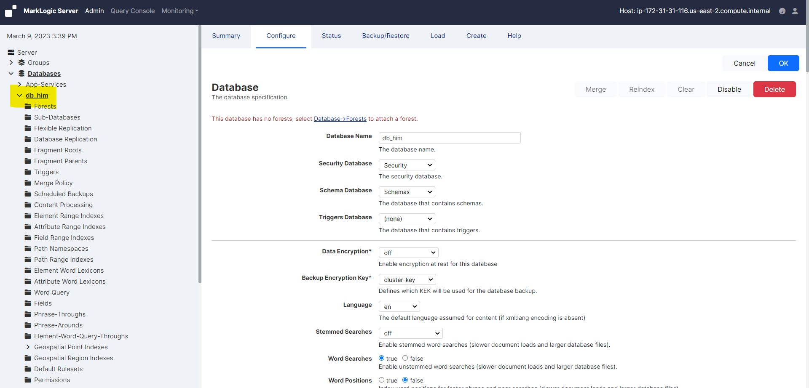

# Create a new Databsase

In this lab we will practice the Database creation. 

### Follow the following steps to create a new database:

* Click the Databases icon in the left tree menu

     <!-- {"left" : 0.26, "top" : 1.45, "height" : 6.17, "width" : 9.74} -->

* Click the Create tab at the top right. The Create Database page displays:

     <!-- {"left" : 0.26, "top" : 1.45, "height" : 6.17, "width" : 9.74} -->

* Enter the name of the database. This is the name the system will use to refer to this database.

     <!-- {"left" : 0.26, "top" : 1.45, "height" : 6.17, "width" : 9.74} -->

* Select a security database to be associated with this database. We recommend selecting Security as the security database.

* Select a schema database to be associated with this database. We selected Schemas as schema database.

     <!-- {"left" : 0.26, "top" : 1.45, "height" : 6.17, "width" : 9.74} -->

* You may leave the rest of the parameters unchanged or set them according to your needs

* Click OK:

* Database successfully created

     <!-- {"left" : 0.26, "top" : 1.45, "height" : 6.17, "width" : 9.74} -->

* You can now attach forests to the database. Creating a database is a hot admin task.