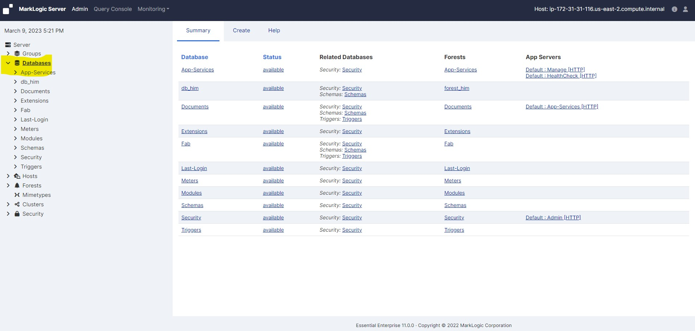
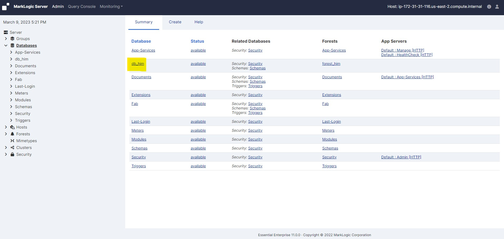
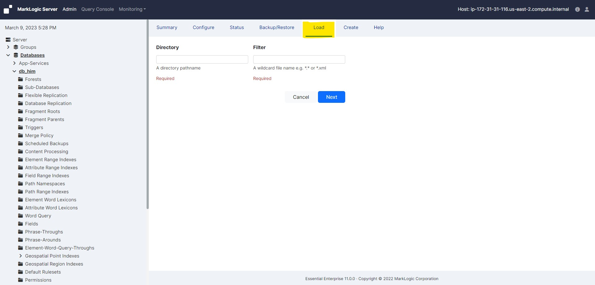
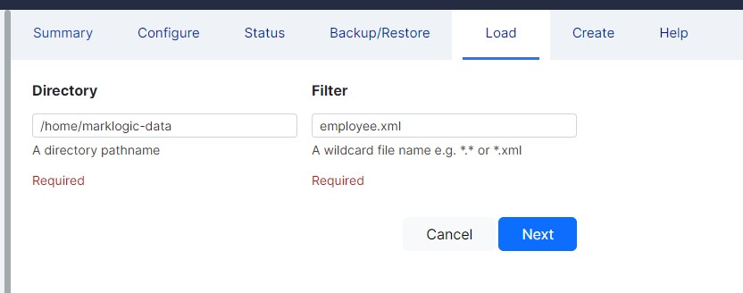
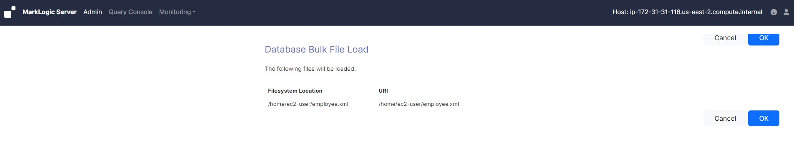
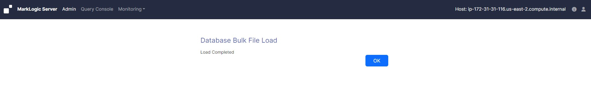

# Load document into a database

### Download the sample file "employee.xml" on your windows machine:

* Go to below github location and download "employee.xml"

    https://github.com/elephantscale/marklogic-labs/blob/main/marklogic-labs/data/employee.xml

* Copy "employee.xml" file to your working directory in windows machine

### Copy "employee.xml" file from windows to EC2
* Copy downloaded "employee.xml" file from windows to EC2
    - Open a new powershell terminal on windows
    - cd to "employee.xml" file location 
    - run below command to copy sample file from windows to EC2. In this case both "Marklogic.pem" and "employee.xml" are in same working directory. This command will copy the file to EC2 instance home directory. If you wish to copy to some other directory just mention the directory path like this "ec2-user@18.222.133.222:/your-dir-path".
        ```shell
        scp -i .\MarkLogic.pem .\employee.xml  ec2-user@18.222.133.222:
        ```

### To load a set of documents into a database, perform the following steps:

* Log into the Admin Interface in a browser. It is on port 8001 of the host in which MarkLogic is running. From your windows machine, http://18.222.133.222:8001 (In this case the EC2 instance IP is 18.222.133.222. Accordingly you neee to change it as per your EC2 instance IP).

* You will be prompted to log in with your admin username and password

     <!-- {"left" : 0.26, "top" : 1.45, "height" : 6.17, "width" : 9.74} -->

* Click the Databases icon on the left tree menu.

     <!-- {"left" : 0.26, "top" : 1.45, "height" : 6.17, "width" : 9.74} -->

* Click on the database into which you want to load the documents:

     <!-- {"left" : 0.26, "top" : 1.45, "height" : 6.17, "width" : 9.74} -->

* Click on the Load tab near the top right.

     <!-- {"left" : 0.26, "top" : 1.45, "height" : 6.17, "width" : 9.74} -->

* Enter the name of the directory in which the documents are located. This directory must be accessible by the host from which the Admin Interface is currently running

* Enter a filter for the names of the documents to be loaded (for example, *.xml to load all files with an xml extension). For an exact match, enter the full name of the document

     <!-- {"left" : 0.26, "top" : 1.45, "height" : 6.17, "width" : 9.74} -->

* The load confirmation screen will list all documents in the specified directory matching the specified filter. Click Ok to complete the load

     <!-- {"left" : 0.26, "top" : 1.45, "height" : 6.17, "width" : 9.74} -->

* Click Ok to Finish

     <!-- {"left" : 0.26, "top" : 1.45, "height" : 6.17, "width" : 9.74} -->

* The documents are loaded into the database. The URI path of the documents are the same as your filesystem path