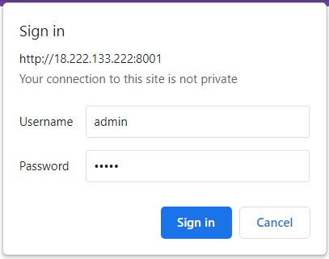
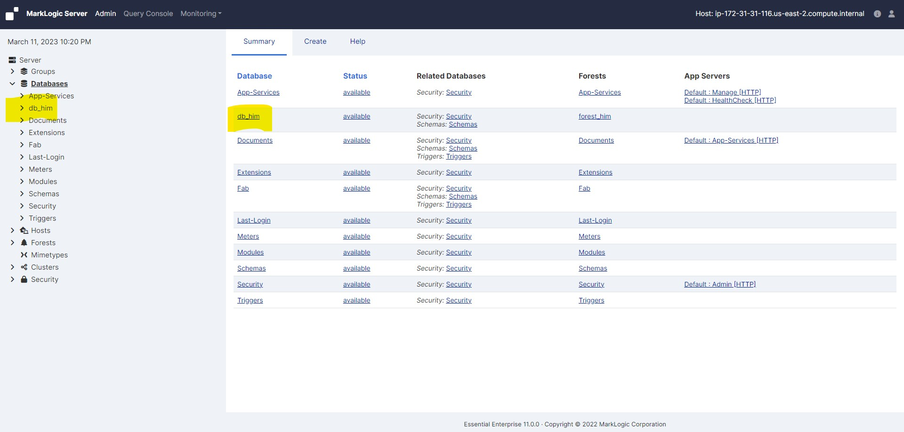
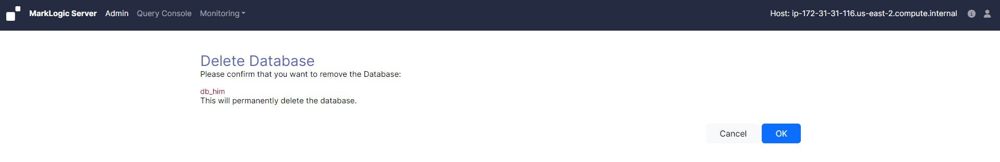

# Deleting a database

### Perform the following steps to delete a database:

* Log into the Admin Interface in a browser. It is on port 8001 of the host in which MarkLogic is running. From your windows machine, http://18.222.133.222:8001 (In this case the EC2 instance IP is 18.222.133.222. Accordingly you neee to change it as per your EC2 instance IP).

* You will be prompted to log in with your admin username and password

     <!-- {"left" : 0.26, "top" : 1.45, "height" : 6.17, "width" : 9.74} -->

* Click the Databases icon on the left tree menu

* Decide which database you want to delete

* Click the database name, either on the tree menu or the summary page

     <!-- {"left" : 0.26, "top" : 1.45, "height" : 6.17, "width" : 9.74} -->

* Click the Delete button on the Database Configuration page

     <!-- {"left" : 0.26, "top" : 1.45, "height" : 6.17, "width" : 9.74} -->

    - Clicking the Clear button clears all of the forests attached to this database, removing all of the data from the forests

    - Clicking the Delete button removes the database configuration, but does not delete the data stored in the forests

* Assuming that there are not any HTTP, WebDAV, or XDBC servers referring to the database, a delete confirmation screen appears. Click OK

     <!-- {"left" : 0.26, "top" : 1.45, "height" : 6.17, "width" : 9.74} -->

* The database is now permanently deleted. Deleting a database is a hot admin task.